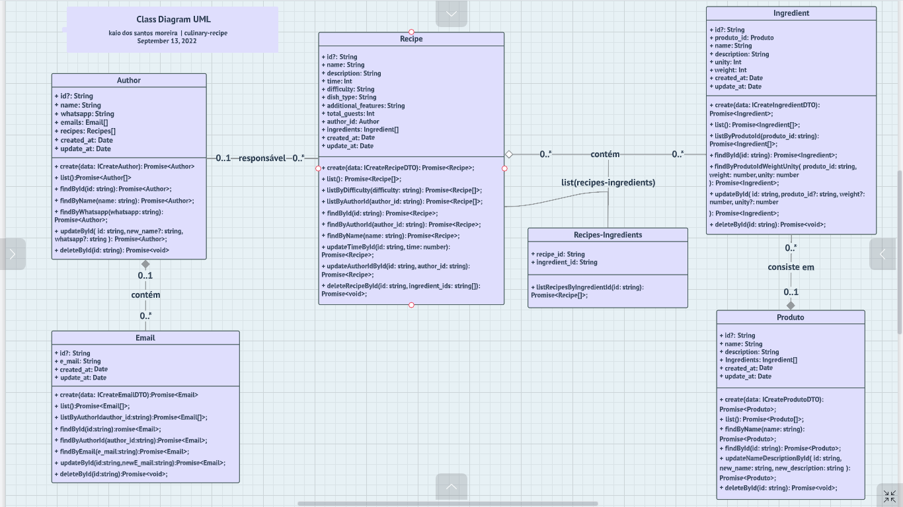
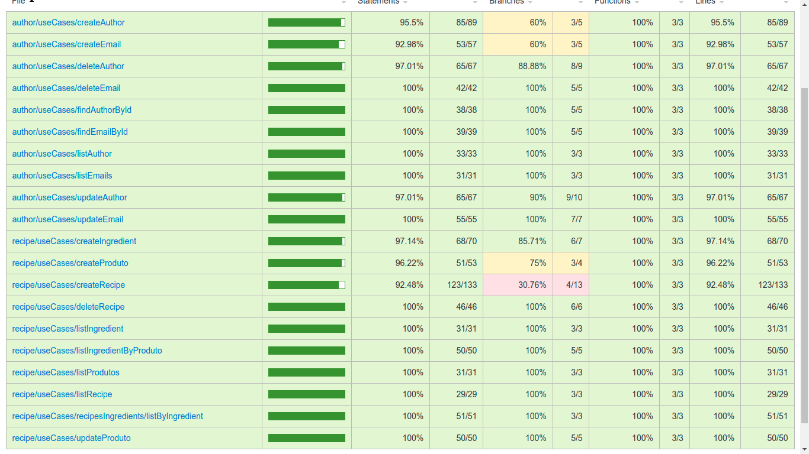

## Descrição
* Essa é uma REST API que tem como objetivo realizar um CRUD de Receitas culinárias. A Receita poderá conter diversos Ingredients como partes que depende de um Produto. E um Author como reponsavel que contém diversos e-mais de contato.

### Pré-requisitos
* Antes de começar, você vai precisar ter instalado em sua máquina as seguintes ferramentas:
[Node.js](https://nodejs.org/en/). 
E o banco de dados Postgres:
[Postgres](https://www.postgresql.org/).
E o docker para utilizar docker-compose para subir o container do Postgres
[Docker](https://https://www.docker.com/).
E instalar o docker-compose pra subir o container.
[Docker-Compose](https://docs.docker.com/compose/install/).
Além disto é bom ter um editor para trabalhar com o código como [VSCode](https://code.visualstudio.com/).

## Diagrama de Classe UML


## Coverage Jest


## Email
**Requisito Funcional**
* Deve ser possivel cadastrar um email.  
* Deve ser possivel buscar todos emails.
* Deve ser possivel buscar email por id.
* Deve ser possivel atualizar email por id.
* Deve ser possivel deletar email por id.  

**Regra de Negócio**
* Nao deve ser possivel cadastrar um email com mesmo email.
* Não deve ser possivel cadastrar email com author invalido.
* Não deve ser possivel buscar email com id invalido.
* Não deve ser possivel atualizar email com id invalido
* Não deve ser possivel deletar email com id invalido.

## Author
**Requisito Funcional**
* Deve ser possivel cadastrar um author.
* Deve ser possivel buscar todos authors.
* Deve ser possivel buscar author por id.
* Deve ser possivel atualizar author por id.
* Deve ser possivel deletar author por id.

**Regra de Negócio**
* Não deve ser possivel criar um author com o mesmo nome. 
* Não deve ser possivel criar um author com o mesmo whatsapp.
* Não deve ser possivel buscar um author com id invalido.
* Não deve ser possivel atualizar um author com id invalido.
* Não deve ser possivel deletar um author com id invalido.

## Recipe
**Requisito Funcional**
* Deve ser possivel cadastrar uma recipe.
* Deve ser possivel buscar todas as recipes existentes.
* Deve ser possivel buscar todas as recipes pelo ingredient_id.
* Deve ser possivel deletar uma recipe por id.

**Regra de Negócio**
* Não deve ser possivel criar uma recipe com difficulty diferente de easy, medium e hard.
* Não deve ser possivel criar uma recipe com dish_type diferente de appetizer, main course e dessert.
* Não deve ser possivel criar uma recipe com author_id invalido.
* Não deve ser possivel criar uma recipe com ingredient_id invalido.
* Não deve ser possivel criar uma recipe com menos de 2 ingredients.
* Não deve ser possivel buscar uma recipe com ingredient_id invalido.
* Não deve ser possivel deletar uma recipe com id invalido.

## Ingredient
**Requisito Funcional**
* Deve deve ser possivel cadastrar um ingredient.
* Deve ser possivel buscar todos os ingredients existentes.
* Deve ser possivel buscar um ingredient por produto_id.

**Regra de Negócio**
* Não deve ser possive criar um ingredient com produto_id invalido.
* Não deve ser possivel criar o mesmo ingredient com unity e weight existentes.

## Produto
**Requisito Funcional**
* Deve ser possivel cadastrar um produto.
* Deve ser possivel listar todos os produtos existentes.
* Deve ser possivel atualizar um produto por id.

**Regra de Negócio**
* Não deve ser possivel cadastrar um produto com o mesmo nome.
* Não deve ser possivel atualizar um produto com id invalido.

## API Production Config
* EC2 - Instancia criada na AWS com uma maquina virtual contendo Ubuntu 20.04 LTS
SSD volume types 64bits x86. Com uma chave .pem configurada usamos para conectar na instancia.
Para uma conexão mais segura com a instancia criamos grupo de usuarios com permissoes de admin.
Um arquivo authorized_keys na pasta .ssg com a chave ssh-keygen conectando a maquina local e a instancia através da chaves. Com a instancia configurada usaremos o ip<publico> da instancia para conectar. Em seguida instalar todos os programas como docker, docker-compose, nodejse e yarn para
funcionamento da api.

* Babel - Configurar o babel na api local instalando libs para compilar API em typescript para javascript de forma mais perfomática e rápida.

* Git/Github - Através do git init criamos um repo local e salvamos toda nossa aplicação gitando cada parte. Em seguida criamos um repositorio no github para salvarmos nossa api, com o intuito de criar o processo de CI/CD da api. Então criamos um chave ssh-key.pub local no github para commitarmos e visitar api de forma mais acessível e segura. Também vamos criar uma chave ssh key para a instancia EC2 da api. 
  
* Clone API - Clonaremos a API na instancia EC2 depois de carregada no repositorio do github e instalaremos todas as bibliotecas da aplicação usando o comando yarn.

* Container Postgress - Alteramos a configurações do serviço do docker-compose container do banco de dados do Postgres criptografando a senha e removendo a porta padrão de conexão 5432:5432.

* GitActions CI/CD - Para configurarmos o processo de CI/CD criaremos uma chave ssh-key.pub local com o nome de gitactions. Pegaremos a chave e colocaremos no arquivo authorized_keys dentro da instancia EC2. Em seguida vamos em nossa api no culinary-recipe no github e criaremos os secrets da api. Criaremos o secres SSH_HOST com ip publico da instancia EC2, SSH_KEY com chave ssh-privada de gitachtions, SSH_USER com o nome user criado na instancia EC2 'app' e SSH_PORT com a port da instancia EC2. Em seguida criaremos e configuruaremos nossa git actions. Para rodar na ultima versão do ubuntu, instalar nodejs, criar os push na main, instalar todas as dependencias da API, criar o build, subir os container dos bancos, rodar todas as mirgations, rodar os tests, configurar host,key,user e port com os secrets. E por fim atualizar novamente todos os pacotes, rodar as migrations mais uma vez e rodar a api com o pm2.


* Proxy Reverso - Primeiro vamos instanlar o servidor HTTP nginx para o proxy reverso. Em seguida vamos até a instancia adicionar regras de entrada no grupo de segurança da instancia. Adicionamos as regras HTTP/HTTPS com ips personalizados 0.0.0.0/0. Por fim na instancia vamos até a pasta do nginx em site-available criaremos um arquivo culinary-recipe com as configurações do server e location. Por fim criaremos um link simbolico em da pasta site-enable para pasta site-available dentro do nginx.
  
* Gerenciado de processo - Instalamos o pm2 para gerenciar os processo do runtine da aplicação. Assim podemos iniciar, restart, parar, monitorar o status, memoria e CPU em produção da API.

* Domínio SSL - Através de um dominio existente entraremos na AWS Route53 e criaremos um nome com o dominio existente. E enviaremos para o dominio o ip publico da instancia para validar o nome do subdominio criado para api. Em whatsmydns.com procuramos pelo o subdominio criado em Route53 para ve se propagou. Em seguida vamos até o site do cerbot nos orientar como instalar o cerbot utilizando nginx. Depois de criado conseguimos acessar a aplicação com um dominio com certificado SSL seguro. 

* Segurança - Na segurança da API configuramos o rate-limiting com o redis para previnir a aplicação de ataques DDoS.
  
* Monitoramento - No monitoramento da aplicação utilizamos o Sentry para capturar toda as atividades feitas nas rotas da aplicação. E também qualquer tipo de error gerado nas rotas ou em qualquer parte da api.

  


### 🎲 Rodando o Back End (servidor)
```bash
# Clone este repositório
$ git clone <https://github.com/kaiomoreira-dev/culinary-recipe.git>

# Acesse a pasta do projeto no terminal/cmd
$ cd culinary-recipes

# Instale as dependências
$ yarn ou npm install

# Exutar apenas o container do postgres
$ docker-compose up -d

## Iniciar aplicação

// desenvolvimento
$ yarn dev ou npm run dev

// teste
$ yarn test ou npm run test

# O servidor inciará na porta:3333 - acesse <http://localhost:3333>

# O banco de dados do postgres fica no docker na porta 5432:5432
```
